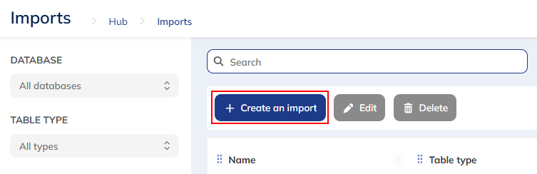

# Multi-File Vendor Import

Processes `inventory.csv`, `pricing.xlsx`, and `categories.csv` from VendorX
into the target database.

---

<!-- label: UploadVendorX -->
## Upload VendorX Files

From the VendorX portal, download `inventory.csv` (required — `Item #` 6 digits,
`Category` one of `Alpha`, `Beta`, `Gamma`) and `categories.csv` (optional
reference list, skip if unchanged).

<!-- label: BuildOutputs -->
## Build Output Files

Produces `Inventory_Import` (merges inventory with category metadata),
`Pricing_Update` (diff against current DB values), and `Audit_Log`
(category/pricing reconciliation) in this step.

<!-- label: ImportFiles -->
## Import into database

Run the imports in this order using the `BulkImport` profile:

1. `Inventory_Import` first.

2. Then `Pricing_Update`.

If there are exceptions, contact `vendor@example.com`.

<!-- label: UploadPricing -->
## Upload Pricing

Provide the `pricing.xlsx` workbook. Use the `Current` sheet with the header on
row 1.

<!-- label: PricingCheck -->
## Verify Pricing

Use the `pricing.xlsx` workbook to verify the Pricing and Categories data segments.